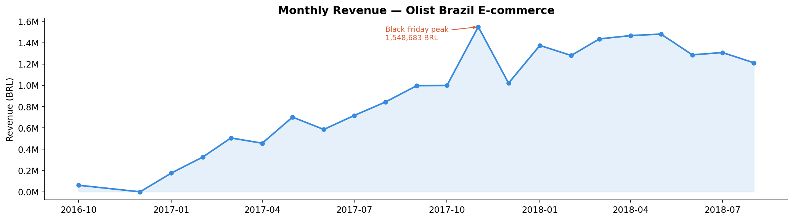
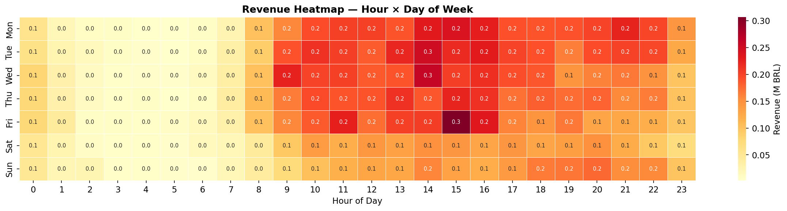
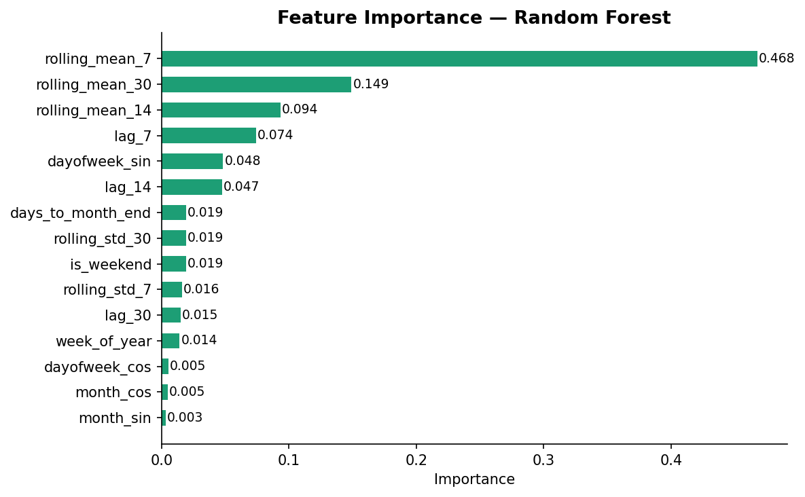
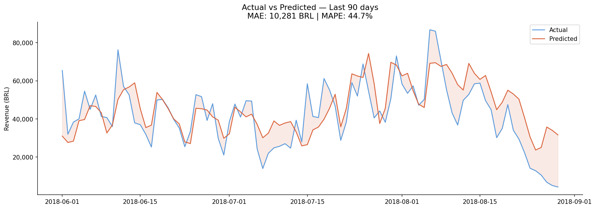
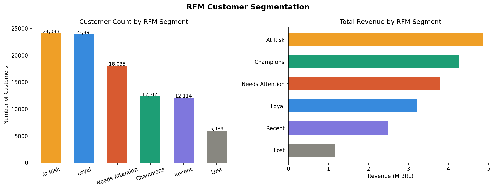

# Retail Revenue Forecasting

### Olist Brazil E-commerce · Time Series · Machine Learning

> **Predicting daily retail revenue** using 2+ years of real transaction data from Brazil's largest e-commerce platform. Demonstrates end-to-end DS workflow: data engineering → EDA → feature engineering → modeling → business insights.

---

## Business Problem

Retail operations teams need **accurate short-term revenue forecasts** (7–30 days ahead) to make informed decisions on inventory procurement, staffing, and promotional planning.

**Key questions answered:**

- What will daily revenue look like next week?
- Which time patterns drive revenue the most?
- Which customer segments are most valuable, and which are at risk?

---

## Dataset

**Source**: [Olist Brazilian E-commerce Dataset](https://www.kaggle.com/datasets/olistbr/brazilian-ecommerce) (Kaggle)

| Property            | Value               |
| ------------------- | ------------------- |
| Period              | Sep 2016 – Oct 2018 |
| Orders (delivered)  | ~97,000             |
| Unique customers    | ~96,000             |
| Product categories  | 73                  |
| Features engineered | 19                  |

---

## Results

| Model                     | MAE (BRL) | RMSE (BRL) |    MAPE (%) |
| ------------------------- | --------: | ---------: | ----------: |
| Baseline (lag_7)          |     9.400 |     17.779 | 294594628.9 |
| Linear Regression (Ridge) |    12.477 |     17.765 |        47.4 |
| Random Forest             |     9.956 |     15.639 |        33.2 |
| Gradient Boosting         |    12.474 |     19.605 |        41.4 |

---

## Key Visualizations

### Monthly Revenue Trend


Revenue grew steadily from Q4-2016 to Q1-2018 , with a clear peak in November 2017 (Black Friday).

### Revenue Heatmap — Hour × Day of Week


Peak purchasing hours are 10:00–21:00 on weekdays. Weekend traffic drops ~15–20% vs weekdays.

### Feature Importance — Random Forest


`lag_7` dominates, confirming strong weekly seasonality. Rolling features capture medium-term trend.

### Actual vs Predicted (last 90 days)



### RFM Customer Segmentation


Champions represent a small fraction of customers but generate disproportionate revenue.

---

## Project Structure

```
retail-revenue-forecast/
│
├── README.md
├── requirements.txt
│
├── notebooks/
│   ├── 01_EDA.ipynb               ← Data exploration & visualization
│   ├── 02_feature_engineering.ipynb  ← Lag, rolling, calendar, RFM, cohort
│   └── 03_modeling.ipynb          ← Model training, CV, evaluation
│
├── src/
│   ├── data_loader.py             ← Load & merge Olist tables
│   ├── features.py                ← All feature engineering functions
│   └── evaluate.py                ← Metrics, CV, and plotting utilities
│
└── images/                        ← Charts embedded in this README
```

---

## Methodology

### Feature Engineering

| Category     | Features                                                           |
| ------------ | ------------------------------------------------------------------ |
| **Lag**      | `lag_7`, `lag_14`, `lag_30`                                        |
| **Rolling**  | `rolling_mean_7/14/30`, `rolling_std_7/30`                         |
| **Calendar** | `month`, `quarter`, `dayofweek`, `is_weekend`, `days_to_month_end` |
| **Cyclical** | `month_sin/cos`, `dayofweek_sin/cos`                               |
| **Holiday**  | `is_holiday`, `is_pre_holiday`, `is_post_holiday`                  |

### Model Validation

- **TimeSeriesSplit** (5 folds) — never uses future data to predict the past
- Metrics: MAE, RMSE, MAPE — selected because revenue data has outliers (holidays)

### Twist — RFM & Cohort Analysis

Beyond forecasting, the project segments customers using:

- **RFM scoring** (Recency · Frequency · Monetary) → 6 behavioral segments
- **Cohort retention** → identifies month-over-month churn patterns

---

## Business Insights

1. **Weekly seasonality is the strongest signal** — `lag_7` consistently ranks as the most important feature. Revenue on a given day correlates strongly with the same day last week.
2. **Black Friday creates a structural break** — the November spike is ~2–3× average daily revenue. Without a holiday flag, models underfit severely on this period.
3. **Weekends underperform** — Saturday and Sunday revenue is consistently 15–20% lower than weekdays, counter-intuitive but consistent across all years.
4. **Champions segment** drives outsized value — the top RFM quartile generates approximately 4–5× the revenue of the bottom quartile, with much higher retention.

---

## How to Run

```bash
# 1. Clone and setup
git clone https://github.com/YOUR_USERNAME/retail-revenue-forecast.git
cd retail-revenue-forecast
pip install -r requirements.txt

# 2. Download dataset from Kaggle
# → Place all CSV files in data/ folder

# 3. Run notebooks in order
jupyter notebook
```

---

## Tech Stack

`Python 3.11` · `pandas` · `numpy` · `scikit-learn` · `matplotlib` · `seaborn`
